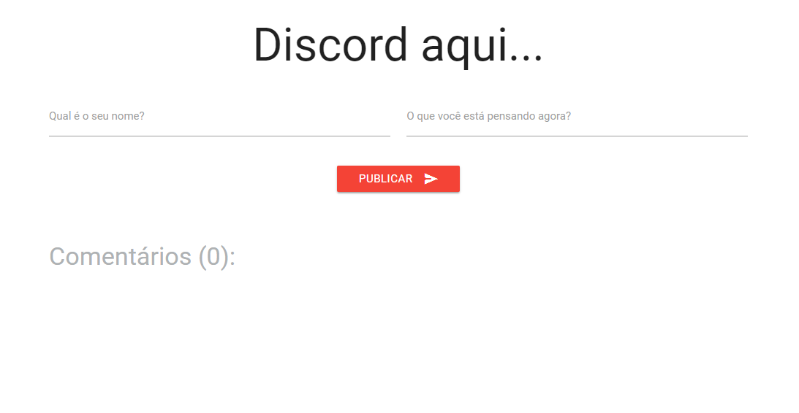
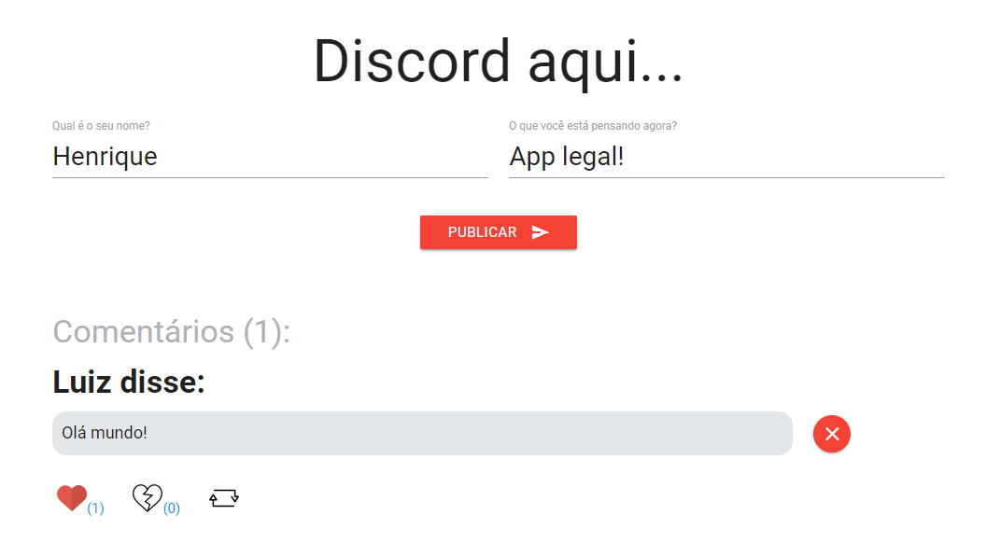
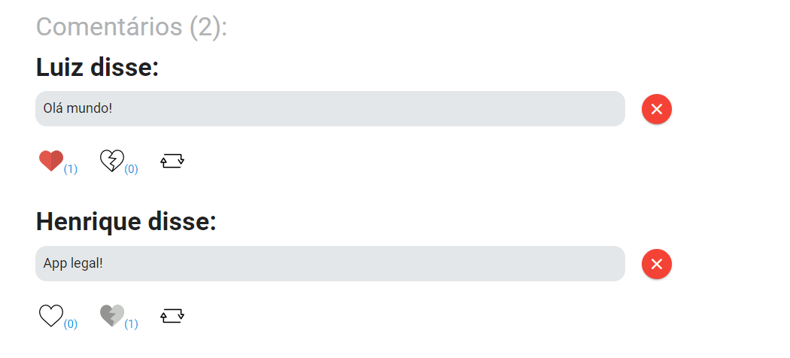

# Introdução

Esse aplicativo é uma simples demonstração de um sistema de comentários, onde é possível publicar algum texto, curtir, descurtir e republicar o mesmo.

# Sobre o build

O app foi criado com a utilização das seguintes ferramentas:

- Materialize-CSS;
- React;
- Redux;
- Webpack

# Execução

No diretória de sua escolha siga os seguintes passos:

- git clone https://github.com/LuizHonorato/discord.git
- npm i
- npm start

# Screenshots

1)

2)

3)

